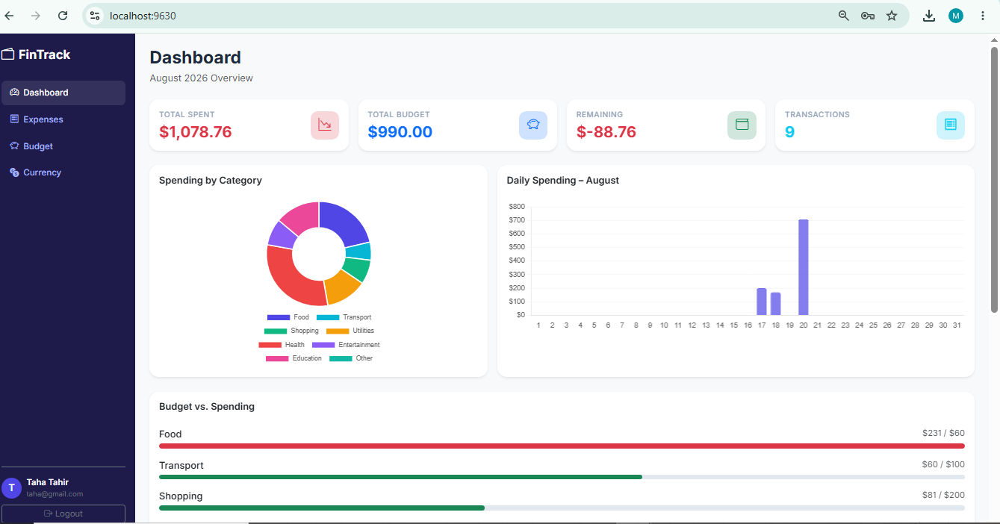
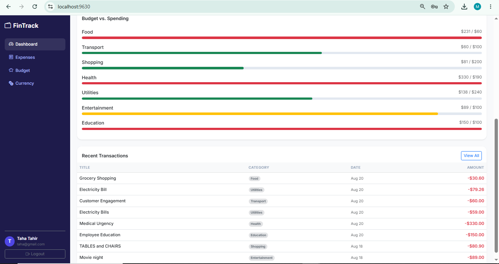
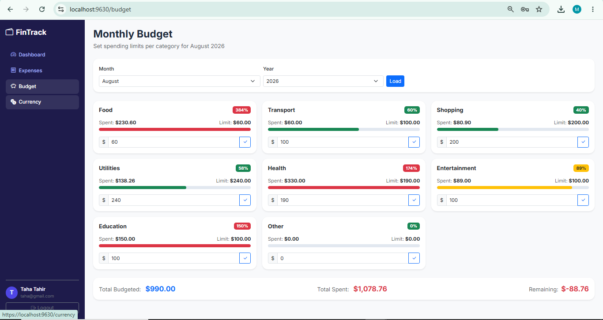
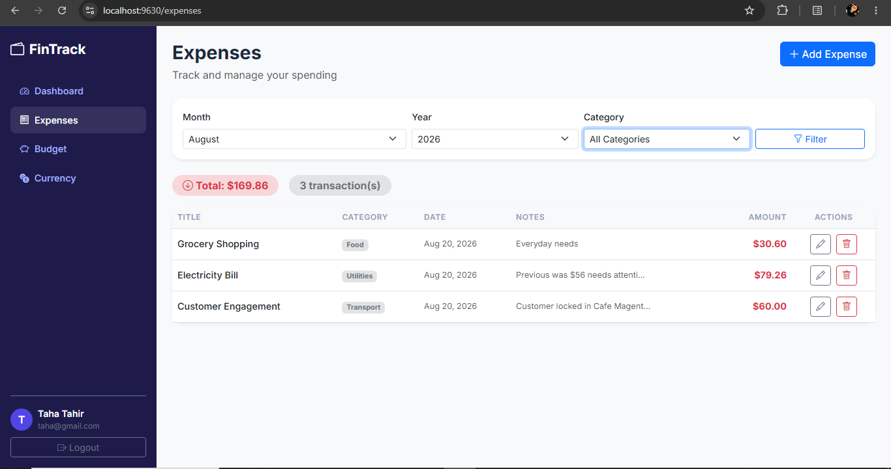
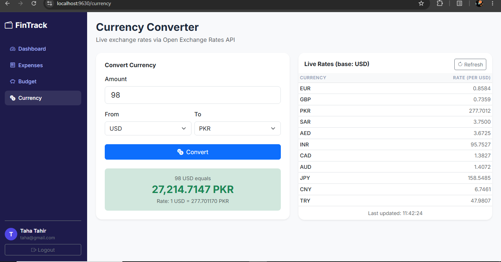

# 💰 FinTrack — Personal Finance & Budget Tracker

**Track expenses, set monthly category budgets with live overspend alerts, and convert currency against real-time exchange rates. Built end to end on Blazor Server (.NET 8) with Entity Framework Core.**


---

## 🎯 What It Does

FinTrack answers three questions people actually have about their money: **where did it go**, **am I over budget**, and **what is this worth in another currency.**

It's a complete full-stack application — custom authentication, persistent storage, an analytics dashboard with interactive charts, and a live external API integration.

---

## 📸 Screenshots

### Dashboard

Spend summary, category breakdown, and daily spending across the month.



### Budget Alerts

Progress bars shift **green → yellow → red** as a category approaches and exceeds its limit. Here: Transport and Utilities are healthy, Entertainment is at 89% (yellow), and Food, Health and Education are over budget (red).



### Monthly Budgets

Set per-category limits with live percentage indicators — Food at 384%, Health at 174%, Entertainment at 89%.



### Expenses & Currency Converter

| Expense management | Live currency conversion |
|---|---|
|  |  |

---

## ✨ Features

### 🔐 Authentication
Custom email/password registration and login. Passwords hashed with **BCrypt** — never stored in plain text. Session state held in a scoped `AppState` service, shared down the component tree via Blazor's cascading-value pattern.

### 📊 Dashboard
- Summary cards — total spent, total budgeted, remaining, transaction count
- **Doughnut chart** — spending distribution by category
- **Bar chart** — daily spending across the current month
- Budget progress bars with colour-coded overspend alerts
- Recent transactions table

Both charts render through **Chart.js via Blazor's JavaScript interop**, since Chart.js is a JS library with no native Blazor equivalent here.

### 🧾 Expenses
Full CRUD with filtering by month, year and category. Confirmation dialog before any delete. Running total and transaction count update live with the filter.

### 💰 Budgets
Per-category monthly limits with visual progress indicators, percentage badges, and a total budgeted / spent / remaining summary.

### 💱 Currency Converter
Live rates from the **Open Exchange Rates API** (`open.er-api.com`) across 12 major currencies including PKR, USD, EUR and GBP, with a refreshable rates table. No API key required, so the feature works on a fresh clone with zero configuration.

### 🔔 Toast Notifications
In-app success / error / warning / info toasts with auto-dismiss, driven by a scoped `ToastService` and a shared `ToastContainer` component.

---

## 🚀 Quick Start — 5 Minutes

**Prerequisites:** .NET 8 SDK

```bash
git clone https://github.com/tahatahirbutt-dev/FinTrack.git
cd FinTrack
dotnet restore
dotnet run
```

Open `https://localhost:5001` (or `http://localhost:5000`) and register an account.

**No database setup, no migrations** — `EnsureCreated()` in `Program.cs` builds `fintrack.db` on first run.

---

## 🗂️ Architecture

```
FinTrack/
├── Data/
│   └── AppDbContext.cs        # EF Core DbContext (SQLite)
├── Models/
│   └── Models.cs              # User, Expense, Budget entities
├── Services/
│   ├── AuthService.cs         # Registration & login, BCrypt hashing
│   ├── AppState.cs            # Scoped session state
│   ├── ExpenseService.cs      # Expense & budget CRUD
│   ├── CurrencyService.cs     # External exchange-rate API client
│   └── ToastService.cs        # Notification queue
├── Pages/
│   ├── _Host.cshtml           # Blazor Server entry point
│   ├── _Layout.cshtml         # HTML shell (Bootstrap, Chart.js)
│   ├── Login.razor
│   ├── Register.razor
│   ├── Dashboard.razor
│   ├── Expenses.razor
│   ├── Budget.razor
│   └── Currency.razor
├── Shared/
│   ├── MainLayout.razor       # Sidebar layout
│   └── ToastContainer.razor
├── wwwroot/
│   ├── css/app.css
│   └── js/charts.js           # Chart.js interop
└── Program.cs                 # DI registration & app setup
```

### Design Decisions

**Services, not code-behind.** All business logic lives in injected scoped services rather than in the Razor components, so pages stay presentational and logic can be reasoned about — or swapped — independently of the UI.

**Scoped state, never static.** `AppState` is registered scoped, which in Blazor Server means *per user circuit*. A static field would have leaked one user's session into every other user's — a subtle but serious bug in a server-rendered model.

**`EnsureCreated()` over migrations.** Chosen so a clone runs immediately with no setup step. The trade-off is documented under Known Limitations.

---

## 🐛 Notable Bug — EF Core Tracking vs. the Blazor Circuit

Worth documenting because the root cause was architectural, not a typo.

**Symptom:** editing an expense threw `InvalidOperationException: The instance of entity type 'Expense' cannot be tracked because another instance with the same key value for {'Id'} is already being tracked.` The circuit then tore down, and every subsequent page load threw a `NullReferenceException` on `AppState.CurrentUser`.

**Root cause:** EF Core's change tracker assumes a short-lived `DbContext` — in ASP.NET MVC, one per request. In **Blazor Server, a scoped `DbContext` lives for the entire circuit**, so entities loaded by a list query stayed tracked indefinitely. When the edit modal returned a *different* object carrying the same `Id`, EF refused to track both. The follow-on null reference was a symptom, not a separate bug: the crash rebuilt the circuit, and `AppState` — being scoped per circuit — came back empty.

**Fix:** fetch the tracked entity and mutate it rather than attaching a detached copy, add `.AsNoTracking()` to all read-only queries, and guard `CurrentUser` with a redirect instead of the null-forgiving `!` operator.

```csharp
var existing = await _db.Expenses.FindAsync(expense.Id);
if (existing is null) return;

existing.Title    = expense.Title;
existing.Amount   = expense.Amount;
// … remaining fields
await _db.SaveChangesAsync();
```

**Production-grade alternative:** `IDbContextFactory<AppDbContext>` with a short-lived context per operation — Microsoft's documented pattern for Blazor Server, and the right fix at scale.

---

## 🛠️ Tech Stack

| Layer | Technology |
|---|---|
| Framework | Blazor Server (.NET 8) |
| ORM | Entity Framework Core |
| Database | SQLite |
| Authentication | Custom, BCrypt.Net-Next |
| UI | Bootstrap 5, Bootstrap Icons |
| Charts | Chart.js 4 via JS interop |
| External API | Open Exchange Rates (`open.er-api.com`) |
| Font | Inter (Google Fonts) |

---

## ⚠️ Known Limitations

Documented deliberately rather than left for a reader to find:

- **`EnsureCreated()` instead of EF migrations.** A fresh clone works with zero setup, but the schema can't be versioned or evolved incrementally — a schema change means deleting the database. Production would use `dotnet ef migrations`.
- **No automated test suite.** Verified manually across registration, expense CRUD, budget alert thresholds and currency conversion. No unit or integration tests yet.
- **Session state is not persistent.** `AppState` lives in the Blazor Server circuit, so a refresh or dropped connection logs the user out. Cookie or token-based auth would fix this.
- **External API has no caching or rate-limit handling.** Every conversion hits the API directly, with no graceful degradation if it's unreachable.
- **Single implicit currency for storage.** Expenses are stored in one currency; the converter is a standalone utility rather than being wired into expense records.

---

## 📄 License

MIT License © 2026 Taha Tahir Butt

---

*Built and developed end to end by [Taha Tahir Butt](https://github.com/tahatahirbutt-dev) — Rawalpindi, Pakistan.*
